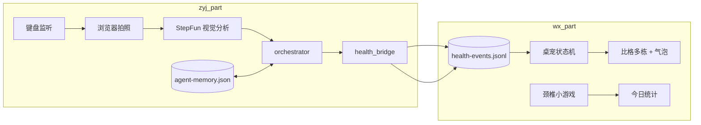

# 清客松（qingkesong）

比格多栋打工人防久坐原型：桌面桌宠 + 班味拍照分析 + **规则 Agent 决策**，通过本地 JSONL 事件流联动。

## 项目结构

```
qingkesong/
├── start.sh                 # 一键启动（推荐）
├── wx_part/                 # 桌宠端（Electron + React）
│   └── PawPause-dodong-worker-pet-merge-20260531/
│       └── README_WORKER_PET.md   # 桌宠状态与 UI 说明
├── zyj_part/                # 班味链路 + Agent（Python Flask + AI）
│   └── README.md                  # Agent 决策与脚本说明
└── frontend_web/            # 启动页静态资源（已合入 wx_part launch 页）
```

| 目录 | 职责 | 技术栈 |
|------|------|--------|
| `wx_part` | 桌面比格多栋桌宠，消费健康事件，维护宠物状态与今日统计 | Electron、React、Vite |
| `zyj_part` | 键盘活跃、拍照、AI 分析、**Agent 选工具写事件** | Python、Flask、pynput、StepFun API |

## 架构与通信

两端不直接 HTTP 对接，通过两个本地文件解耦：

| 文件 | 写入方 | 读取方 | 用途 |
|------|--------|--------|------|
| `~/.local/share/pawpause/health-events.jsonl` | zyj_part (`health_bridge`) | wx_part (`main.ts` health bridge) | 桌宠状态事件 |
| `~/.local/share/pawpause/agent-memory.json` | zyj_part (`memory`) | zyj_part (`orchestrator`) | 当日提醒次数、冷却、是否已做操 |



## 环境要求

- **macOS**（当前主要验证平台；Windows 需自行适配启动脚本）
- **Node.js 18+** 与 **corepack / pnpm**
- **Python 3.10+**
- 摄像头、网络（调用 StepFun API 分析班味）
- macOS 上 Python 进程使用 `pynput` 监听键盘时，可能需要在「系统设置 → 隐私与安全性 → 输入监控 / 辅助功能」中授权

## 首次安装

### 1. 桌宠端（wx_part）

```bash
cd wx_part/PawPause-dodong-worker-pet-merge-20260531
corepack pnpm install
```

### 2. 班味链路（zyj_part）

```bash
cd zyj_part
python3 -m venv .venv
source .venv/bin/activate
pip install -r requirements.txt
```

### 3. API Key

班味 AI 分析需要 StepFun API Key。在运行前设置环境变量（二选一）：

```bash
export STEP_API_KEY="你的密钥"
```

或在根目录 `start.sh` 中配置（**请勿将含真实密钥的脚本提交到公开仓库**）。

## 一键启动

在仓库根目录：

```bash
chmod +x start.sh   # 首次
./start.sh
```

脚本会并行启动：

| 服务 | 地址 | 说明 |
|------|------|------|
| 桌宠 | Electron 窗口 + `http://localhost:5173` | 比格多栋浮在桌面 |
| 班味页 | `http://127.0.0.1:5001` | 自动打开浏览器，调摄像头拍照 |

按 `Ctrl+C` 停止全部进程。

## 手动启动（分两个终端）

**终端 1 — 桌宠**

```bash
cd wx_part/PawPause-dodong-worker-pet-merge-20260531
corepack pnpm dev
```

**终端 2 — 班味链路**

```bash
cd zyj_part
source .venv/bin/activate
export STEP_API_KEY="你的密钥"
python browser_photo.py
```

建议先启动桌宠，再启动班味链路，以便 JSONL 事件能被及时消费。

## 演示流程简述

1. 桌宠启动后，比格多栋显示在桌面（默认 70% 尺寸）。
2. 班味页在浏览器中打开摄像头；键盘持续活跃达到条件后自动拍照。
3. `camera_ai` 调用 StepFun 分析表情/姿态，输出 `emotion_label` + `banwei_heavy`。
4. **Agent（`orchestrator`）** 根据当日 memory 决策：
   - 第一次检测 → 温和 `banwei_result` 提醒；
   - 复检且班味仍重 → `neck_guide` 引导颈椎操；
   - 冷却期内或今日已做操 → 静默 `noop`。
5. 决策结果经 `health_bridge` 写入 JSONL；桌宠每 5 秒 tail 新事件并切换状态。
6. 点击桌宠或气泡打开颈椎小游戏；完成后桌宠更新今日次数与活力值。
7. 鼠标悬停桌宠可查看「今日颈椎操 X 次 / 活力 Y」。

### 跳过摄像头测试

**Agent 完整用例**（推荐，需桌宠在跑）：

```bash
cd zyj_part && source .venv/bin/activate && python test_orchestrator.py
```

**单次冒烟**：

```bash
cd zyj_part && source .venv/bin/activate && python test_ui_flow.py
```

## 可选环境变量

```bash
# 自定义 JSONL 路径（wx / zyj 共用）
export PAWPAUSE_HEALTH_EVENTS=/absolute/path/to/health-events.jsonl

# Agent 当日记忆（仅 zyj_part）
export PAWPAUSE_AGENT_MEMORY=/absolute/path/to/agent-memory.json

# StepFun 模型与接口（默认 step-3.7-flash）
export STEP_MODEL=step-3.7-flash
export STEP_BASE_URL=https://api.stepfun.com/v1
```

## 进一步阅读

- 桌宠状态机、事件格式、交互说明：[wx_part/README_WORKER_PET.md](wx_part/README_WORKER_PET.md)
- Agent 决策规则、memory 字段、脚本说明：[zyj_part/README.md](zyj_part/README.md)
- Health Bridge 协议：[wx_part/PawPause-dodong-worker-pet-merge-20260531/docs/HEALTH_BRIDGE.md](wx_part/PawPause-dodong-worker-pet-merge-20260531/docs/HEALTH_BRIDGE.md)

## 目录命名说明

仓库保留 `wx_part`、`zyj_part` 作为子模块目录名，便于对应分工与 git 历史。**不建议在展示前批量重命名**：实际硬编码路径仅出现在根目录 `start.sh`，改名收益有限，但会导致 git 大量 rename 记录。若日后需要更友好的对外名称，可在 README 中使用中文别名说明，或在项目稳定后用 `git mv` 一次性重命名并同步更新 `start.sh`。
