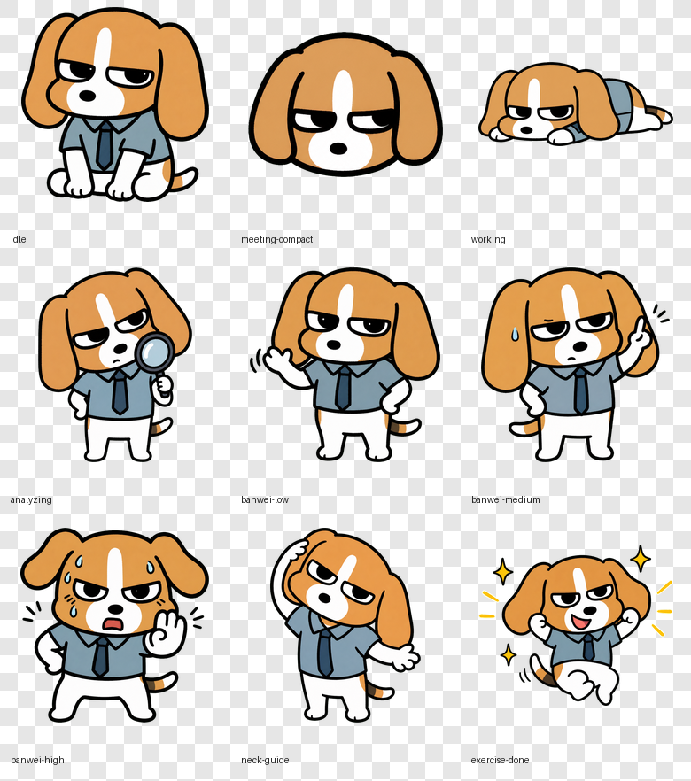

# 比格多栋打工人防久坐桌宠 MVP

这是基于 PawPause 改造的内部原型版桌宠，用于承接飞书日历、键鼠活跃、拍照班味分析链路，并在桌面上用“比格多栋”风格小狗做低打扰提醒。



## 现在能做什么

- 默认显示小号比格多栋桌宠，约 70% 尺寸。
- 会议中缩成豆包式悬浮球，不弹提醒。
- 连续键鼠活跃 30 分钟后，由外部链路拍照分析班味，再把结果写入本地事件流。
- 班味分为 `low`、`medium`、`high` 三档。
- 第一次班味检测只弹温和提醒，不强制打开游戏。
- 之后复检仍有班味时，外部链路发送 `neck_guide`，桌宠进入颈椎活动引导状态。
- 点击桌宠或气泡按钮，打开颈椎小游戏窗口。
- 双击桌宠打开现场演示面板，可一键切换普通、会议、工作、分析、班味、颈椎引导和完成状态。
- 不展示照片，只展示班味结论和建议。

## 运行方式

```sh
corepack pnpm install
corepack pnpm dev
```

Electron 桌宠会浮在桌面上。颈椎小游戏（八拍 MediaPipe 版）会在点击桌宠、气泡按钮或托盘菜单时打开；开发模式下也可直接访问：

```text
http://localhost:5173/game1.html
```

生产构建检查：

```sh
corepack pnpm typecheck
corepack pnpm build
```

## 本地事件流

桌宠不直接接飞书、键鼠或摄像头。外部链路只需要把 JSONL 事件追加到本地文件：

```text
~/.local/share/pawpause/health-events.jsonl
```

也可以用环境变量覆盖：

```sh
PAWPAUSE_HEALTH_EVENTS=/absolute/path/to/health-events.jsonl
```

事件格式：

```json
{
  "id": "stable-event-id",
  "type": "banwei_result",
  "timestampMs": 1780110000000,
  "payload": {
    "banweiLevel": "medium",
    "banweiScore": 72,
    "message": "班味有点上来了，先伸个懒腰压一压。",
    "suggestedAction": "none"
  }
}
```

支持的 `type`：

- `meeting_start`：进入会议悬浮球，会议期间静默丢弃其他提醒。
- `meeting_end`：恢复普通桌宠。
- `work_active`：进入认真工作状态，不弹气泡。
- `analyzing`：短暂显示分析中状态。
- `banwei_result`：展示低/中/高班味温和提醒，不打开小游戏。
- `neck_guide`：进入颈椎引导状态，气泡按钮打开小游戏。
- `exercise_done`：展示完成反馈，然后回到默认状态。

## 快速测试

```sh
mkdir -p ~/.local/share/pawpause
```

会议悬浮球：

```sh
printf '%s\n' '{"id":"demo-meeting-start","type":"meeting_start"}' >> ~/.local/share/pawpause/health-events.jsonl
printf '%s\n' '{"id":"demo-meeting-end","type":"meeting_end"}' >> ~/.local/share/pawpause/health-events.jsonl
```

第一次班味提醒：

```sh
printf '%s\n' '{"id":"demo-banwei-medium","type":"banwei_result","payload":{"banweiLevel":"medium","banweiScore":72,"message":"班味有点上来了，先伸个懒腰压一压。"}}' >> ~/.local/share/pawpause/health-events.jsonl
```

颈椎引导：

```sh
printf '%s\n' '{"id":"demo-neck-guide","type":"neck_guide","payload":{"message":"多栋先动了，你随意，真的随意。","suggestedAction":"exercise"}}' >> ~/.local/share/pawpause/health-events.jsonl
```

注意：`id` 会去重。重复测试时请换一个新的 `id`。

现场演示更推荐直接双击桌宠：

- 单击桌宠：打开颈椎小游戏窗口。
- 双击桌宠：展开状态演示面板。
- 面板按钮：直接触发对应桌宠状态和文案，适合给嘉宾快速展示。

## 默认文案口吻

外部事件如果不传 `payload.message`，桌宠会使用内置文案。每个班味档位和颈椎引导都有 3 条随机文案，并且会带上动态班味分数。

低班味示例：

- `班味 28 分刚冒头，伸个懒腰还能救。`
- `28 分不严重，但多栋已经闻到了。`
- `班味轻微泄漏，建议假装活动一下。`

中班味示例：

- `班味 67 分，工位封印开始生效了。`
- `67 分。你和椅子的关系是不是太稳定了？`
- `多栋建议：现在站起来，保住一点人类感。`

高班味示例：

- `班味 91 分。你快和工位合体了。`
- `91 分，高危。颈椎已经在抗议。`
- `这个班味，多栋闻了都想请年假。`

颈椎引导示例：

- `多栋先动了，你随意，真的随意。`
- `我都开始活动了，你还在那儿焊椅子？`
- `陪多栋动一下嘛，就一下。`

## 比格狗 UI 素材

透明底 PNG 已生成在：

```text
assets/dodong-states/transparent/
```

包含：

- `idle.png`
- `meeting-compact.png`
- `working.png`
- `analyzing.png`
- `banwei-low.png`
- `banwei-medium.png`
- `banwei-high.png`
- `neck-guide.png`
- `exercise-done.png`

原始绿幕图保存在：

```text
assets/dodong-states/raw/
```

状态素材 prompt 记录在：

```text
docs/DODONG_STATE_PROMPTS.md
```

## 研发合并提示

- 主入口仍是 Electron + React + Vite。
- 旧 PawPause 的喝水、专注、AI agent、分心检测等主动逻辑已在 worker pet 模式下关闭。
- 当前默认宠物为 `dodong`，并强制小尺寸 `0.7`。
- 当前代码里同时保留 CSS 版原型小狗和 PNG 状态素材。PNG 适合作为后续替换成正式 spritesheet 的资产基础。
- 如果未来要对外上线或商用，需要确认“比格多栋”IP 授权，或替换为原创比格犬形象。
